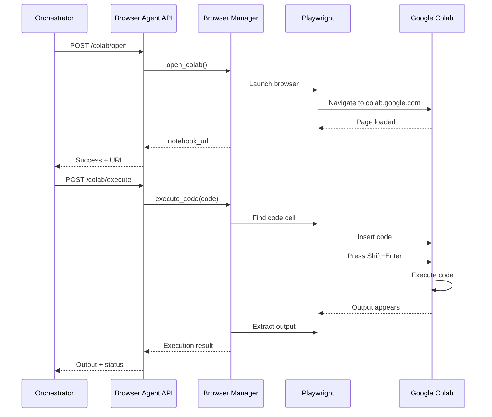

# Browser Agent Service

The Hands 🤖 of the Auto-DataScientist system. Provides browser automation for Google Colab using Playwright.

## Architecture

```
┌─────────────────────────────────────────────┐
│    Browser Agent Service (Port 8001)        │
├─────────────────────────────────────────────┤
│  ┌──────────┐  ┌────────────────────────┐  │
│  │ FastAPI  │  │   Playwright Browser   │  │
│  │ REST API │──│   (Chromium/Chrome)    │  │
│  └──────────┘  └────────────────────────┘  │
│                         │                   │
│  ┌──────────────────────┼─────────────────┐ │
│  │     Automation       │                 │ │
│  │  ┌─────────────┐  ┌───────────────┐  │ │
│  │  │ Google      │  │   Dataset     │  │ │
│  │  │ Colab       │  │   Downloader  │  │ │
│  │  └─────────────┘  └───────────────┘  │ │
│  └──────────────────────────────────────────┘ │
└─────────────────────────────────────────────┘
```

## Components

### 1. **main.py** - FastAPI Application
RESTful API endpoints for browser automation:
- `POST /colab/open` - Open Google Colab
- `POST /colab/execute` - Execute code in Colab
- `POST /colab/close` - Close Colab session
- `POST /dataset/download` - Download datasets
- `GET /health` - Health check

### 2. **browser.py** - Browser Manager
Playwright browser lifecycle management:
- Singleton pattern for browser instance
- Chromium browser with anti-detection
- Page management
- Session persistence

### 3. **colab_automation.py** - Colab Utilities
Specialized Colab interactions:
- Code cell operations
- Cell execution
- Output retrieval
- Error detection
- Notebook manipulation

### 4. **downloader.py** - Dataset Downloader
Multi-source dataset downloading:
- HTTP/HTTPS URLs
- Kaggle datasets (with API)
- File validation
- Progress tracking

## API Usage

### Open Google Colab

```bash
curl -X POST "http://localhost:8001/colab/open" \
  -H "Content-Type: application/json" \
  -d '{
    "notebook_name": "ml_pipeline.ipynb"
  }'
```

Response:
```json
{
  "success": true,
  "notebook_url": "https://colab.research.google.com/...",
  "message": "Google Colab opened successfully"
}
```

### Execute Code in Colab

```bash
curl -X POST "http://localhost:8001/colab/execute" \
  -H "Content-Type: application/json" \
  -d '{
    "code": "import pandas as pd\ndf = pd.read_csv(\"data.csv\")\nprint(df.head())",
    "notebook_name": "eda_analysis.ipynb",
    "wait_for_output": true
  }'
```

Response:
```json
{
  "success": true,
  "output": "   col1  col2\n0     1     2\n...",
  "error": "",
  "execution_time": 2.34
}
```

### Download Dataset

```bash
curl -X POST "http://localhost:8001/dataset/download?url=https://example.com/data.csv&destination=/data/dataset.csv"
```

Response:
```json
{
  "success": true,
  "file_path": "/data/dataset.csv",
  "message": "Dataset downloaded successfully"
}
```

### Close Colab Session

```bash
curl -X POST "http://localhost:8001/colab/close"
```

## Running the Service

### Local Development

```bash
# From monorepo root
cd services/browser_agent

# Install Playwright browsers (first time only)
poetry run playwright install chromium

# Run the service
poetry run python src/main.py

# Or with uvicorn directly
poetry run uvicorn src.main:app --reload --port 8001
```

### With Docker

```bash
# From monorepo root
docker-compose up browser_agent
```

### Environment Variables

Create `.env` file:
```env
# Service Configuration
HOST=0.0.0.0
PORT=8001
LOG_LEVEL=INFO

# Browser Configuration
HEADLESS=false
BROWSER_TIMEOUT=60000

# Google Credentials (for Colab authentication)
GOOGLE_EMAIL=your-email@gmail.com
GOOGLE_PASSWORD=your-password

# Kaggle API (for dataset downloads)
KAGGLE_USERNAME=your-username
KAGGLE_KEY=your-api-key
```

## Colab Automation Workflow



## Usage Examples

### Example 1: Execute EDA Code

```python
import httpx

async def execute_eda():
    async with httpx.AsyncClient() as client:
        # Open Colab
        response = await client.post(
            "http://localhost:8001/colab/open",
            json={"notebook_name": "eda.ipynb"}
        )
        print(response.json())
        
        # Execute code
        code = """
import pandas as pd
df = pd.read_csv('/content/data.csv')
print(df.info())
print(df.describe())
"""
        
        response = await client.post(
            "http://localhost:8001/colab/execute",
            json={
                "code": code,
                "wait_for_output": True
            }
        )
        
        result = response.json()
        print(f"Output: {result['output']}")
```

### Example 2: Download and Process Dataset

```python
async def download_and_process():
    async with httpx.AsyncClient() as client:
        # Download dataset
        response = await client.post(
            "http://localhost:8001/dataset/download",
            params={
                "url": "https://example.com/titanic.csv",
                "destination": "/data/titanic.csv"
            }
        )
        
        file_path = response.json()["file_path"]
        
        # Upload to Colab and process
        # (In practice, you'd upload the file to Colab first)
        code = f"""
import pandas as pd
df = pd.read_csv('{file_path}')
print(f"Dataset shape: {{df.shape}}")
"""
        
        response = await client.post(
            "http://localhost:8001/colab/execute",
            json={"code": code}
        )
```

## Integration with Orchestrator

The orchestrator calls the browser agent when:

1. **Data Engineering Agent** generates EDA code
   ```python
   # In orchestrator workflow
   response = await httpx.post(
       "http://localhost:8001/colab/execute",
       json={"code": state["code_context"].eda_code}
   )
   ```

2. **ML Agent** generates training code
   ```python
   response = await httpx.post(
       "http://localhost:8001/colab/execute",
       json={"code": state["code_context"].model_code}
   )
   ```

## Playwright Selectors

Colab selectors are defined in `ColabSelectors` class:

```python
class ColabSelectors:
    CODE_CELL = ".cell"
    RUN_BUTTON = "button[aria-label='Run cell']"
    OUTPUT_TEXT = ".output_text"
    OUTPUT_ERROR = ".output_error"
    # ... more selectors
```

**Note**: Google Colab's UI may change. Update selectors as needed.

## Error Handling

The browser agent handles various error scenarios:

1. **Browser Launch Failure**
   - Retries with different options
   - Falls back to headless mode

2. **Colab Authentication**
   - Detects login page
   - Uses provided credentials
   - Handles 2FA (manual intervention)

3. **Code Execution Errors**
   - Captures error output
   - Returns error details
   - Includes stack traces

4. **Network Issues**
   - Timeout handling
   - Retry logic
   - Graceful degradation

## Development

### Add New Colab Operation

1. Add method to `ColabAutomation`:
```python
async def my_new_operation(self) -> bool:
    # Implementation
    return True
```

2. Add endpoint to `main.py`:
```python
@app.post("/colab/my-operation")
async def my_operation():
    from .browser import browser_manager
    result = await browser_manager.my_new_operation()
    return {"success": result}
```

### Testing

```bash
# Run tests
poetry run pytest tests/test_browser_agent.py -v

# Test with headful browser (see what's happening)
HEADLESS=false poetry run python src/main.py
```

## Production Considerations

**Current Implementation** (MVP):
- ✅ Basic Playwright automation
- ✅ Singleton browser instance
- ✅ Async code execution
- ✅ Error handling

**Production Requirements**:
- 🔲 Browser pool for concurrent requests
- 🔲 Session management (multiple notebooks)
- 🔲 Robust authentication handling
- 🔲 Screenshot/video recording
- 🔲 Resource cleanup (zombie browsers)
- 🔲 Rate limiting
- 🔲 Proxy support

## Troubleshooting

### Browser Won't Launch

```bash
# Install system dependencies
poetry run playwright install-deps

# Install browsers
poetry run playwright install chromium
```

### Selectors Not Working

1. Open browser in headful mode
2. Inspect elements in browser DevTools
3. Update selectors in `ColabSelectors`

### Authentication Issues

1. Use environment variables for credentials
2. Consider using authentication tokens
3. Handle 2FA manually or with automation

## License

See main project LICENSE.
