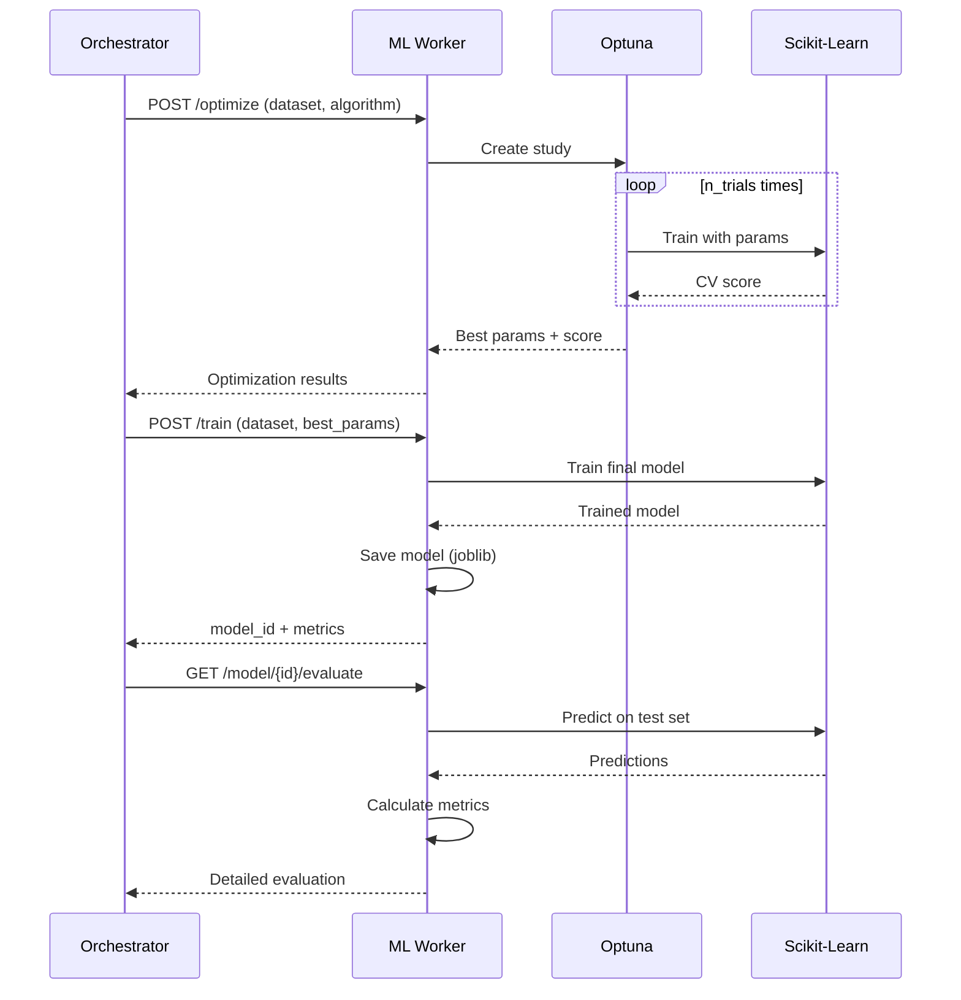

# ML Worker Service

The Muscle 💪 of the Auto-DataScientist system. Handles machine learning model training and hyperparameter optimization using Optuna.

## Architecture

```
┌─────────────────────────────────────────────┐
│      ML Worker Service (Port 8002)          │
├─────────────────────────────────────────────┤
│  ┌──────────┐  ┌────────────────────────┐  │
│  │ FastAPI  │  │   Scikit-Learn         │  │
│  │ REST API │──│   Model Training       │  │
│  └──────────┘  └────────────────────────┘  │
│                         │                   │
│  ┌──────────────────────┼─────────────────┐ │
│  │     ML Components    │                 │ │
│  │  ┌─────────────┐  ┌───────────────┐  │ │
│  │  │ Optuna      │  │   Model       │  │ │
│  │  │ Optimizer   │  │   Evaluator   │  │ │
│  │  └─────────────┘  └───────────────┘  │ │
│  └──────────────────────────────────────────┘ │
└─────────────────────────────────────────────┘
```

## Components

### 1. **main.py** - FastAPI Application
RESTful API endpoints for ML operations:
- `POST /train` - Train a model
- `POST /optimize` - Optimize hyperparameters
- `GET /model/{id}/evaluate` - Evaluate model
- `GET /algorithms` - List supported algorithms
- `GET /health` - Health check

### 2. **trainer.py** - Model Trainer
Training with multiple algorithms:
- RandomForestClassifier/Regressor
- LogisticRegression
- GradientBoostingClassifier
- SVC (Support Vector Classifier)
- LinearRegression
- XGBoost (optional)

Features:
- Automatic metric calculation
- Model persistence with joblib
- Metadata tracking
- Train/test splitting

### 3. **optuna_optimizer.py** - Hyperparameter Optimization
Optuna-based optimization:
- TPE (Tree-structured Parzen Estimator) sampler
- Algorithm-specific search spaces
- Cross-validation
- SQLite storage for study persistence
- Configurable trials and timeout

### 4. **evaluator.py** - Model Evaluation
Comprehensive evaluation:
- Classification/regression metrics
- Confusion matrices
- Classification reports
- Feature importance
- Model comparison

## API Usage

### Train a Model

```bash
curl -X POST "http://localhost:8002/train" \
  -H "Content-Type: application/json" \
  -d '{
    "dataset_path": "/data/churn.csv",
    "target_column": "Churn",
    "algorithm": "RandomForestClassifier",
    "test_size": 0.2,
    "random_state": 42
  }'
```

Response:
```json
{
  "success": true,
  "model_id": "model-abc123",
  "metrics": {
    "accuracy": 0.85,
    "precision": 0.84,
    "recall": 0.86,
    "f1_score": 0.85
  },
  "message": "Model trained successfully"
}
```

### Optimize Hyperparameters

```bash
curl -X POST "http://localhost:8002/optimize" \
  -H "Content-Type: application/json" \
  -d '{
    "dataset_path": "/data/churn.csv",
    "target_column": "Churn",
    "algorithm": "RandomForestClassifier",
    "n_trials": 100
  }'
```

Response:
```json
{
  "success": true,
  "study_id": "study-xyz789",
  "best_params": {
    "n_estimators": 250,
    "max_depth": 12,
    "min_samples_split": 5,
    "max_features": "sqrt"
  },
  "best_score": 0.87,
  "n_trials": 100
}
```

### Evaluate Model

```bash
curl "http://localhost:8002/model/model-abc123/evaluate"
```

Response:
```json
{
  "metrics": {
    "accuracy": 0.85,
    "precision": 0.84,
    "recall": 0.86,
    "f1_score": 0.85
  },
  "confusion_matrix": [[80, 10], [12, 98]],
  "classification_report": "...",
  "feature_importance": {
    "tenure": 0.25,
    "monthly_charges": 0.18,
    ...
  }
}
```

### List Algorithms

```bash
curl "http://localhost:8002/algorithms"
```

## Running the Service

### Local Development

```bash
# From monorepo root
cd services/ml_worker

# Run the service
poetry run python src/main.py

# Or with uvicorn directly
poetry run uvicorn src.main:app --reload --port 8002
```

### With Docker

```bash
# From monorepo root
docker-compose up ml_worker
```

### Environment Variables

Create `.env` file:
```env
# Service Configuration
HOST=0.0.0.0
PORT=8002
LOG_LEVEL=INFO

# Optuna Configuration
OPTUNA_STORAGE=sqlite:///optuna.db
MAX_TRIALS=100

# Model Storage
MODELS_DIR=./models
```

## Supported Algorithms

### Classification

- **RandomForestClassifier** - Ensemble of decision trees
- **LogisticRegression** - Linear classification
- **GradientBoostingClassifier** - Boosted trees
- **SVC** - Support Vector Machine

### Regression

- **RandomForestRegressor** - Ensemble regression
- **LinearRegression** - Linear regression
- **GradientBoostingRegressor** - Boosted regression

## Hyperparameter Search Spaces

### RandomForestClassifier

```python
{
    "n_estimators": 50-500,
    "max_depth": 3-20,
    "min_samples_split": 2-20,
    "min_samples_leaf": 1-10,
    "max_features": ["sqrt", "log2", None]
}
```

### GradientBoostingClassifier

```python
{
    "n_estimators": 50-500,
    "learning_rate": 0.001-0.3 (log scale),
    "max_depth": 3-10,
    "subsample": 0.5-1.0
}
```

### LogisticRegression

```python
{
    "C": 0.001-100 (log scale),
    "penalty": ["l1", "l2", "elasticnet", None],
    "solver": ["lbfgs", "liblinear", "saga"],
    "max_iter": 100-1000
}
```

## Integration with Orchestrator

The ML Worker is called by the orchestrator's ML Agent:

```python
# In orchestrator ML Agent
import httpx

# Train with best hyperparameters
response = await httpx.post(
    "http://localhost:8002/train",
    json={
        "dataset_path": state["dataset_info"].file_path,
        "target_column": "target",
        "algorithm": "RandomForestClassifier",
        "hyperparams": best_params  # From optimization
    }
)

if response.status_code == 200:
    result = response.json()
    model_id = result["model_id"]
    state["messages"].append(
        AIMessage(content=f"Model trained with accuracy: {result['metrics']['accuracy']}")
    )
```

## Workflow Example



## Model Persistence

Models are saved using joblib:

```
models/
├── model-abc123.joblib
├── model-def456.joblib
└── model-ghi789.joblib
```

Metadata is stored in memory (production: database):

```python
{
    "model_id": "model-abc123",
    "algorithm": "RandomForestClassifier",
    "created_at": "2026-01-14T10:39:00Z",
    "metrics": {...},
    "hyperparams": {...}
}
```

## Metrics Explained

### Classification Metrics

- **Accuracy**: (TP + TN) / Total
- **Precision**: TP / (TP + FP)
- **Recall**: TP / (TP + FN)
- **F1-Score**: 2 * (Precision * Recall) / (Precision + Recall)

### Regression Metrics

- **MSE**: Mean Squared Error
- **RMSE**: Root Mean Squared Error
- **MAE**: Mean Absolute Error
- **R² Score**: Coefficient of determination

## Development

### Add New Algorithm

1. Add to `ALGORITHMS` dict in `trainer.py`:
```python
ALGORITHMS = {
    ...
    "MyNewAlgorithm": MyNewAlgorithmClass
}
```

2. Add hyperparameter space in `optuna_optimizer.py`:
```python
def _get_hyperparameter_space(self, trial, algorithm):
    if algorithm == "MyNewAlgorithm":
        return {
            "param1": trial.suggest_int("param1", 1, 100),
            ...
        }
```

### Testing

```bash
# Run tests
poetry run pytest tests/test_ml_worker.py -v

# Test with real dataset
# Place a CSV file in /data/ and test the endpoints
```

## Production Considerations

**Current Implementation** (MVP):
- ✅ Multiple algorithm support
- ✅ Optuna optimization
- ✅ Model persistence
- ✅ Comprehensive metrics

**Production Requirements**:
- 🔲 Database for model metadata (PostgreSQL/MongoDB)
- 🔲 Model versioning
- 🔲 Model registry (MLflow)
- 🔲 Distributed training (Dask/Ray)
- 🔲 GPU support
- 🔲 Model serving (separate service)
- 🔲 A/B testing framework
- 🔲 Model monitoring

## Troubleshooting

### Optuna Database Lock

If you see database lock errors:
```bash
# Clear Optuna database
rm optuna.db
```

### Memory Issues with Large Datasets

```python
# Use chunking for large datasets
df = pd.read_csv("data.csv", chunksize=10000)
```

### Slow Training

- Reduce `n_trials` for faster optimization
- Use fewer CV folds
- Sample your dataset for initial experiments

## License

See main project LICENSE.
