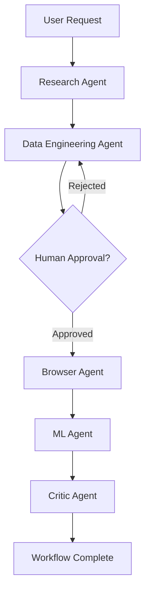

# Orchestrator Service

The Brain 🧠 of the Auto-DataScientist system. Coordinates AI agent workflows using FastAPI and LangGraph.

## Architecture

```
┌─────────────────────────────────────────┐
│     Orchestrator Service (Port 8000)    │
├─────────────────────────────────────────┤
│  ┌──────────┐  ┌─────────────────────┐ │
│  │ FastAPI  │  │   LangGraph         │ │
│  │ REST API │──│   Workflow Engine   │ │
│  └──────────┘  └─────────────────────┘ │
│                         │               │
│  ┌──────────────────────┼─────────────┐ │
│  │     Agent Nodes      │             │ │
│  │  ┌──────────┐  ┌─────────────┐   │ │
│  │  │ Research │  │ DataEng     │   │ │
│  │  └──────────┘  └─────────────┘   │ │
│  │  ┌──────────┐  ┌─────────────┐   │ │
│  │  │ ML Agent │  │ Critic      │   │ │
│  │  └──────────┘  └─────────────┘   │ │
│  └────────────────────────────────────┘ │
└─────────────────────────────────────────┘
```

## Components

### 1. **main.py** - FastAPI Application
RESTful API endpoints for workflow management:
- `POST /workflow/start` - Start new workflow
- `GET /workflow/{id}/status` - Get workflow status
- `POST /workflow/{id}/approve` - Approve manual step
- `POST /workflow/{id}/reject` - Reject manual step
- `GET /workflows` - List all workflows
- `GET /health` - Health check

### 2. **workflow.py** - LangGraph Workflow
State machine with AI agent nodes:
- **Research Agent**: Finds datasets, creates research plan
- **Data Engineering Agent**: Generates EDA code
- **ML Agent**: Generates model training code
- **Critic Agent**: Reviews code and provides feedback

### 3. **state_manager.py** - State Persistence
Manages workflow state and metadata:
- In-memory storage (production: Redis/PostgreSQL)
- Workflow lifecycle management
- Approval/rejection handling

## API Usage

### Start a Workflow

```bash
curl -X POST "http://localhost:8000/workflow/start" \
  -H "Content-Type: application/json" \
  -d '{
    "user_goal": "Build a customer churn prediction model",
    "dataset_url": "https://example.com/churn.csv"
  }'
```

Response:
```json
{
  "workflow_id": "wf-abc123",
  "status": "started",
  "message": "Workflow initialized and running"
}
```

### Check Status

```bash
curl "http://localhost:8000/workflow/wf-abc123/status"
```

Response:
```json
{
  "workflow_id": "wf-abc123",
  "status": "running",
  "current_step": "data_engineering_agent",
  "user_goal": "Build a customer churn prediction model",
  "research_plan_steps": 5,
  "feedback_count": 0
}
```

### Approve Step

```bash
curl -X POST "http://localhost:8000/workflow/wf-abc123/approve"
```

### List All Workflows

```bash
curl "http://localhost:8000/workflows"
```

## Running the Service

### Local Development

```bash
# From monorepo root
cd services/orchestrator

# Run with uvicorn
poetry run uvicorn src.main:app --reload --port 8000

# Or use the main.py __main__ block
poetry run python src/main.py
```

### With Docker

```bash
# From monorepo root
docker-compose up orchestrator
```

### Environment Variables

Create `.env` file:
```env
# Service Configuration
HOST=0.0.0.0
PORT=8000
LOG_LEVEL=INFO

# External Services
BROWSER_AGENT_URL=http://localhost:8001
ML_WORKER_URL=http://localhost:8002

# LLM API Keys
OPENAI_API_KEY=your-key-here
ANTHROPIC_API_KEY=your-key-here
```

## Agent Workflow



## State Flow

Each agent receives and returns `AgentState`:

```python
{
    "messages": [...],  # Conversation history
    "user_goal": "Build churn model",
    "dataset_info": {...},
    "research_plan": ["step1", "step2"],
    "code_context": {...},
    "review_feedback": [...],
    "human_approval": "PENDING",
    "next_step": "data_engineering_agent"
}
```

## Development

### Add New Agent

1. Define agent function in `workflow.py`:
```python
def new_agent(state: AgentState) -> AgentState:
    # Agent logic here
    state["next_step"] = "next_agent_name"
    return state
```

2. Add node to workflow:
```python
workflow.add_node("new_agent", new_agent)
```

3. Add routing logic:
```python
workflow.add_conditional_edges("new_agent", route_next_agent)
```

### Testing

```bash
# Run tests
poetry run pytest tests/ -v

# Test specific service
poetry run pytest tests/test_orchestrator.py -v

# With coverage
poetry run pytest --cov=services/orchestrator
```

## Production Considerations

**Current Implementation** (MVP):
- ✅ In-memory state storage
- ✅ Synchronous workflow execution
- ✅ Basic error handling

**Production Requirements**:
- 🔲 Persistent state (Redis/PostgreSQL)
- 🔲 Async workflow execution (Celery/background tasks)
- 🔲 Retry logic and error recovery
- 🔲 Authentication and authorization
- 🔲 Rate limiting
- 🔲 Monitoring and observability
- 🔲 Kubernetes deployment

## Integration Points

### Browser Agent (Port 8001)
```python
# Call browser agent to execute code in Colab
response = httpx.post(
    f"{BROWSER_AGENT_URL}/execute",
    json={"code": state["code_context"].eda_code}
)
```

### ML Worker (Port 8002)
```python
# Call ML worker for training
response = httpx.post(
    f"{ML_WORKER_URL}/train",
    json={"dataset": state["dataset_info"].file_path}
)
```

## Logging

All operations are logged with structured JSON:

```json
{
  "timestamp": "2026-01-14T10:29:41Z",
  "level": "INFO",
  "logger": "orchestrator",
  "message": "Workflow started successfully",
  "workflow_id": "wf-abc123",
  "user_goal": "Build churn model"
}
```

## License

See main project LICENSE.
